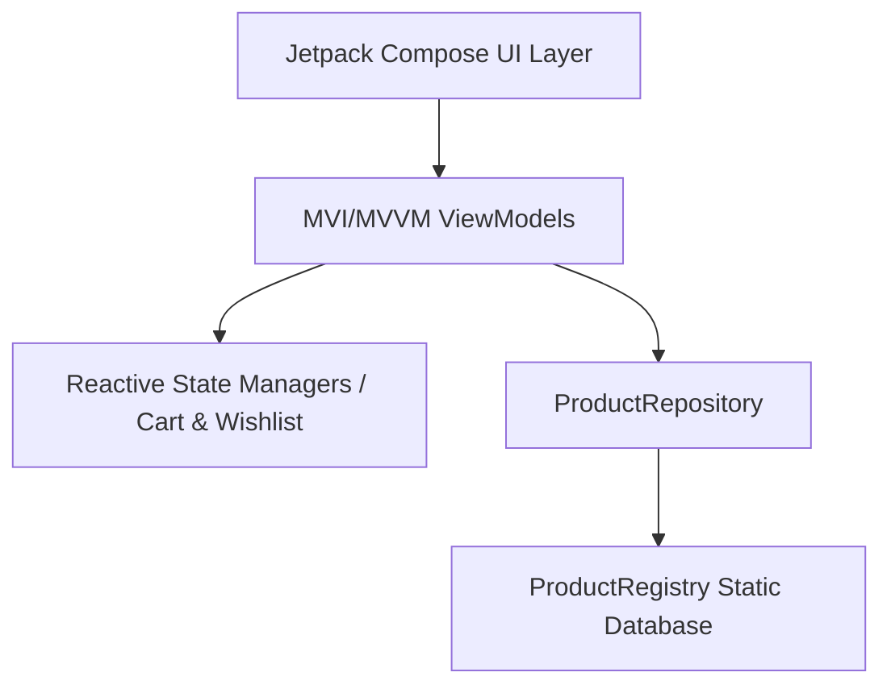

# Minori Mobile App 🎨🏺

Minori is a beautifully designed, premium mobile marketplace application for art lovers and independent creators. It connects buyers with independent studios selling hand-thrown ceramics, woven textiles, oil paintings, woodwork, and glassware. 

The application is built entirely using **Android Jetpack Compose**, **Kotlin**, and **Dagger Hilt**, following modern Clean Architecture, MVVM/MVI patterns, and high-fidelity custom Canvas drawings.

---

## ✨ Design Aesthetic & Theme

Minori features a curated, warm, and organic **bohemian brand identity** designed to feel like an artistic editorial space:
- **Backgrounds**: Soft, organic warm white/sand (`SandCream` - `#FEFBF7`)
- **Accents & Primary Elements**: Burnt terracotta rust (`Terracotta` - `#C2410C` in Light Mode, `SoftTerracotta` - `#FDBA74` in Dark Mode)
- **Secondary Details**: Earthy Sage Olive Green (`SageGreen` - `#606C38`)
- **Typography**: Elegant Serif fonts for headers and clean Sans-Serif fonts for readability.
- **Adaptive Themes**: Seamless transitions between organic Light Cream and Obsidian Warm Slate (`#1C1917`) Dark themes.

---

## 🚀 Key Features & UI Screens

### 1. 🌀 Animated Splash Screen
- **Procedural Monogram Logo**: Renders Pebble 1 (Terracotta), Pebble 2 (Clay), and a Sage Leaf stem procedurally using Compose `Canvas` with multi-wash opacity overlay. No raster image artifacts.
- **Kinetic Typography Animation**: Letters slide together as letter-spacing spring-settles from `0.3.em` to `0.04.em`.
- **Staggered Spring Physics**: Bounce-scale and slide-up transitions on the brand monogram.

### 2. 📖 Onboarding Flow
- Three editorial onboarding pages featuring handcrafted illustrations outlining the platform's vision:
  - *Discover Unique Crafts*
  - *Support Local Artisans*
  - *Acquire Handcrafted Art*
- Dot indicator progress animations and standard `Next`, `Prev`, and `Skip` navigation triggers.

### 3. 🔐 Secure Authentication Suite
- **Custom Components**: Clean, reusable `MinoriTextField` featuring input validation error boundaries (red border outline) and keyboard actions.
- **Procedural Social Sign-in**: Pixel-perfect circular buttons for Google, Apple, and Facebook drawn dynamically using Compose `Canvas` shapes and vector paths.
- **Screen Flow**:
  - **Login**: Credential checking, custom password visibility mask toggling, and links to signup/reset options.
  - **Signup**: Input validation (names, emails, passwords) and confirm-password matching.
  - **Forgot Password**: Password reset submission and instructions with circular back navigation.

### 4. 🏺 Rich Home Screen & Dashboard
- **Top Bar**: Drawer button, small procedurally rendered brand monogram, and custom user avatar outline.
- **Search & Filter Suite**: Rounded search field with microphone outline icon and custom sort/filter popup triggers.
- **Featured Categories**: Horizontal category list (Ceramics, Paintings, Fiber Art, Woodwork, Glassware) displaying custom hand-drawn Canvas illustrations inside circular highlights.
- **Swipeable Promo Pager**: Carousel pager showing rotating studio discounts (e.g. 50-40% OFF Ceramics) with slide dots.
- **Deal of the Day**: Header bar featuring a live ticking countdown timer leading into a horizontal product grid (bowl, pitcher details, rating stars, price tags, and discounts).
- **Special Offers & Collections**: High-fidelity promotional banners displaying hand-woven tapestries, wood chests, and decanter details.
- **Bottom Navigation**: Sticky navigation bar with a prominent, floating circular Shopping Cart button in the center.

### 5. 🛍️ Unified Shopping Cart
- **Reactive State Management**: Powered by a Hilt-injected `@Singleton` `CartManager` exposing `StateFlow<List<CartItem>>` for live UI synchronization across all screens.
- **Interactive Pill Quantity Controllers**: Easily increment, decrement, or remove items directly within the cart list.
- **Procedural Canvas Graphics**: Displays custom vector illustrations including a hand-drawn empty cart basket and a trash-can delete icon.
- **Detailed Billing Summary**: Summarizes Subtotal, Delivery Charges, GST (5%), and Grand Total in local currency (₹ INR).
- **Checkout Overlay**: High-fidelity modal displaying a custom Canvas-drawn checkmark anim and generated Order Reference IDs (`#MN-XXXXXX`).

### 6. 💖 Personal Collection (Wishlist)
- **Global Wishlist Manager**: Hilt-injected `@Singleton` `WishlistManager` coordinates wishlisted states globally. Heart icons update instantly across feeds.
- **Live Search Filtering**: Search saved artifacts by name or category on the fly.
- **Curated Grid Layout**: Displays wishlisted items with star ratings, custom discount badges, origin tags, and a quick "Acquire" button.
- **Empty State Feedback**: Features a custom Canvas-drawn bohemian woven basket illustrating an empty collection.

### 7. 🔍 Interactive Product Details
- **Detail Tabs**: Features dynamic tab navigation between *About* (editorial description), *Specs* (Maker name, materials, specifications, origin, and delivery times), and *Reviews* (authentic customer feedback and star counts).
- **Custom Header Image**: Features floating circular action buttons for back navigation and cart access with a live badge count overlay.
- **Quantity Selector**: Add multiple quantities before adding to the cart or checking out.
- **Double CTA Actions**: Integrated "Add to Cart" and "Buy Now" bottom bar buttons styled with matching border brushes.

### 8. 🏺 Category Specific Feeds
- **Studio Ceramics**: Displays stoneware, porcelain, earthenware, and raku artifacts with firing temperature tags.
- **Fine Arts**: Displays cast bronze, linocuts, hammered metal, and alabaster sculptures with custom edition annotations.
- **Paintings**: Displays oil, watercolor, acrylic, and gouache studies with dimensions.
- **Sort & Filter Menus**: Dropdown menus for sorting (Price, Ratings, Popularity) and filtering by material/medium on each category screen.

### 9. 🔍 Advanced Search Engine
- **Live Search Filtering**: Real-time product filtering and search matching as the user types.
- **Search History**: Stores and manages recent search history items for quick re-entry.
- **Aesthetic Empty States**: Displays custom Canvas-drawn bohemian illustration when no matching products are found.

### 10. 💳 Multi-Step Checkout Flow
- **State Coordination**: Supported by a Hilt-injected `@Singleton` `CheckoutManager` managing address structures, shipping selections, and payment method choices.
- **Address Details Screen**: Elegant text entry fields with validation feedback, address type selection (Home/Work), and persistent state.
- **Order Preview Screen**: Comprehensive billing breakdown including item totals, selected shipping method, GST, and final summary pricing.
- **Payment Portal**: Interactive choice of payment methods (Card, UPI, Cash on Delivery, NetBanking) with dynamic modern card layouts and order placement confirmation.

### 11. ⚙️ Settings & Customization
- **Theme Switcher**: Fluid toggle for Dark Mode supporting Light (bohemian SandCream) and Dark (Obsidian slate) themes.
- **Profile & Preferences**: Clean, structured dashboard providing access to user profile information, order notifications, and support resources.
- **Secure Logout**: Safely clears state managers and navigates users back to the authentication portal.

---

## 🏛️ Architecture Details

The codebase adheres to clean Android architecture principles:



### Modular Packaging Structure
- `core/navigation`: Custom Screen routes, NavHost controllers, and NavGraph routing.
- `core/cart`: `CartManager` tracking item structures and totals.
- `core/wishlist`: `WishlistManager` managing in-memory saved artifacts and mapping extensions.
- `core/checkout`: `CheckoutManager` managing address, shipping, and payment state during checkout.
- `core/common`: `ProductRegistry` providing high-fidelity mocked catalog data for all feeds.
- `domain/model`: Shared domain models (`Product`, `WishlistItem`, `CartItem`).
- `mainui/authentication`: Auth components and Login/Signup/ForgotPassword screens.
- `mainui/homescreen`: Main dashboard, search triggers, and bottom navigation controls.
- `mainui/cartscreen`: Order summary, item list, and checkout overlay.
- `mainui/wishlistscreen`: My Collection saved grid, filtering, and search inputs.
- `mainui/productdetailscreen`: Product pages, tab contents, and review models.
- `mainui/searchscreen`: Query bar, matching categories, search history, and empty states.
- `mainui/settingsscreen`: Configuration options, notifications, and Dark Mode theme toggling.
- `mainui/addressdetailscreen`, `orderpreviewscreen`, `paymentscreen`: Modularized step-by-step checkout UI flow components.
- `mainui/ceramicscreen`, `paintingscreen`, `fineartsscreen`: Specific listing pages with custom sorting & filtering menus.

---

## 🛠️ Build & Installation

### Prerequisites
- Android Studio Ladybug (2024.2.1) or higher
- JDK 17
- Android SDK 34

### Compilation
Build the application and verify Kotlin compile checks via Gradle:
```powershell
# Windows PowerShell
.\gradlew compileDebugKotlin

# Linux / macOS Terminal
./gradlew compileDebugKotlin
```

### Running the App
Deploy the debug build to an active device or emulator:
```powershell
# Install debug APK on your device/emulator
.\gradlew installDebug
```
